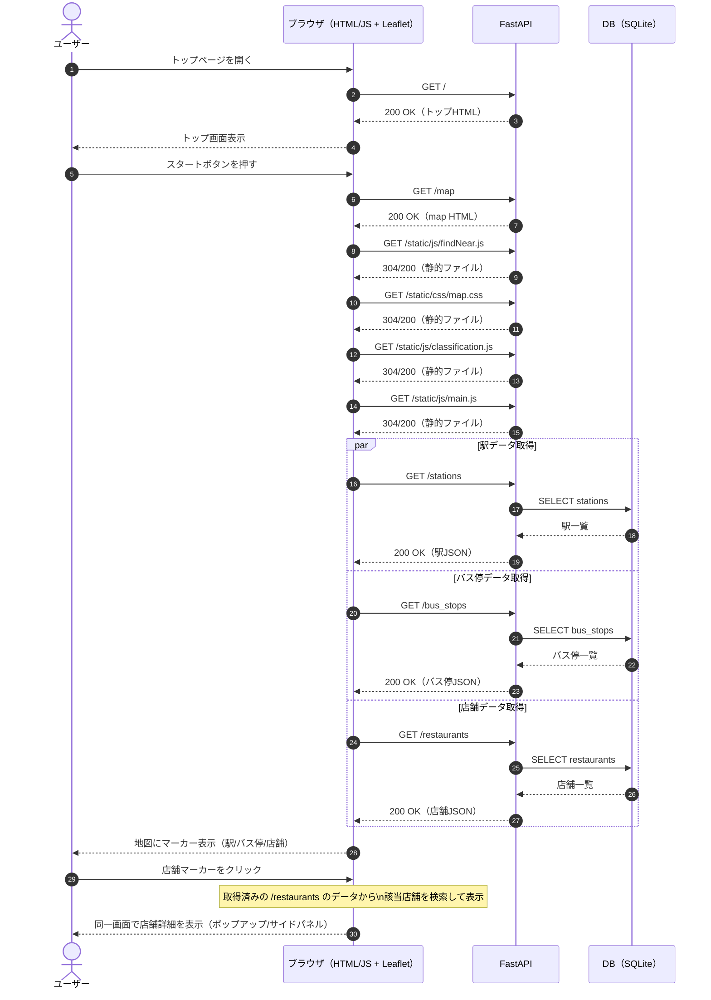

```mermaid
sequenceDiagram
  autonumber
  actor User as ユーザー
  participant UI as ブラウザ（HTML/JS + Leaflet）
  participant API as FastAPI
  participant DB as DB（SQLite）

  %% トップページ表示
  User->>UI: トップページを開く
  UI->>API: GET /
  API-->>UI: 200 OK（トップHTML）
  UI-->>User: トップ画面表示

  %% スタートボタンで地図ページへ
  User->>UI: スタートボタンを押す
  UI->>API: GET /map
  API-->>UI: 200 OK（map HTML）
  UI->>API: GET /static/js/findNear.js
  API-->>UI: 304/200（静的ファイル）
  UI->>API: GET /static/css/map.css
  API-->>UI: 304/200（静的ファイル）
  UI->>API: GET /static/js/classification.js
  API-->>UI: 304/200（静的ファイル）
  UI->>API: GET /static/js/main.js
  API-->>UI: 304/200（静的ファイル）

  %% 地図表示に必要なデータを取得
  par 駅データ取得
    UI->>API: GET /stations
    API->>DB: SELECT stations
    DB-->>API: 駅一覧
    API-->>UI: 200 OK（駅JSON）
  and バス停データ取得
    UI->>API: GET /bus_stops
    API->>DB: SELECT bus_stops
    DB-->>API: バス停一覧
    API-->>UI: 200 OK（バス停JSON）
  and 店舗データ取得
    UI->>API: GET /restaurants
    API->>DB: SELECT restaurants
    DB-->>API: 店舗一覧
    API-->>UI: 200 OK（店舗JSON）
  end

  UI-->>User: 地図にマーカー表示（駅/バス停/店舗）

  %% 店舗詳細は同一画面内（追加APIなし）
  User->>UI: 店舗マーカーをクリック
  Note over UI: 取得済みの /restaurants のデータから\n該当店舗を検索して表示
  UI-->>User: 同一画面で店舗詳細を表示（ポップアップ/サイドパネル）
```